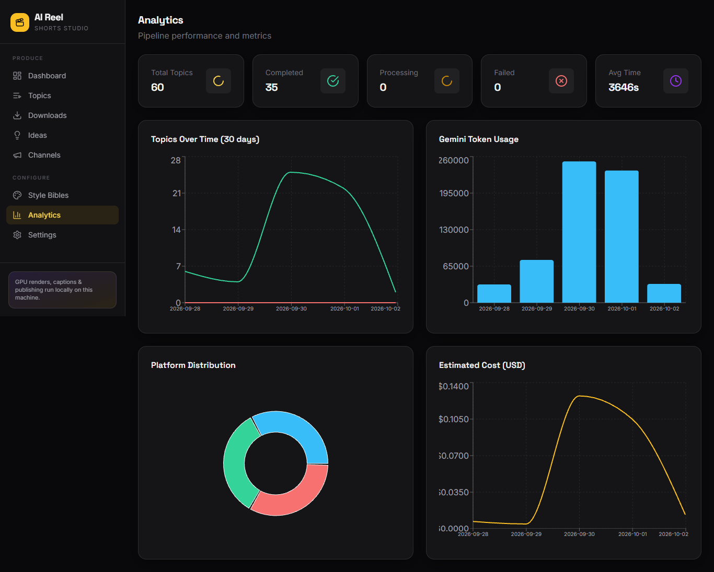
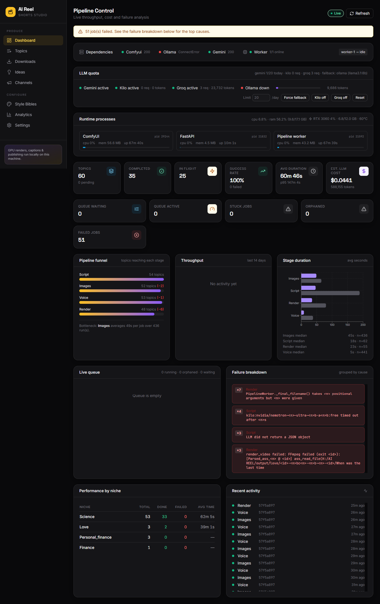
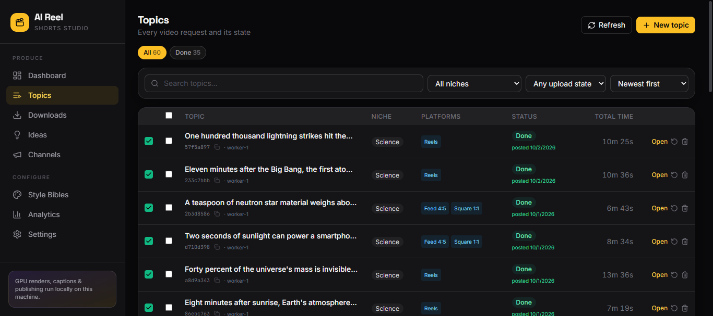
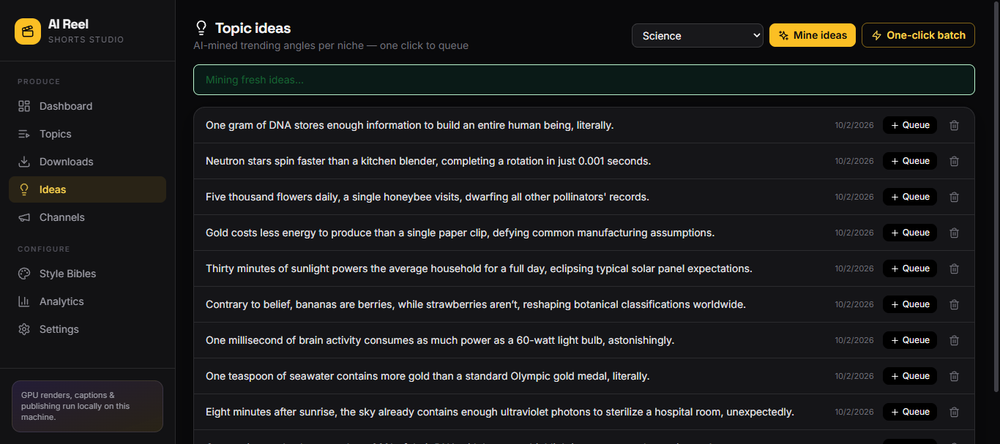
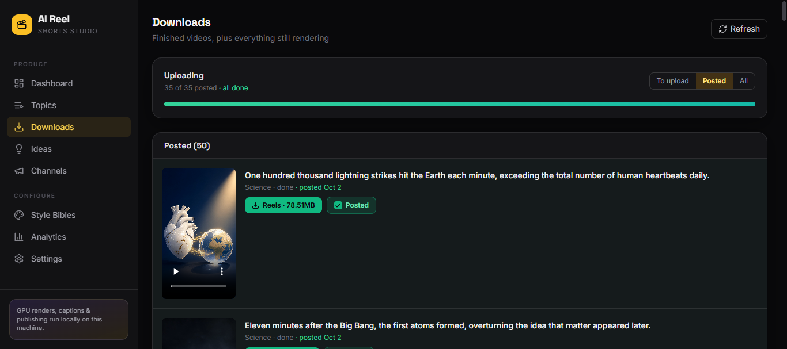
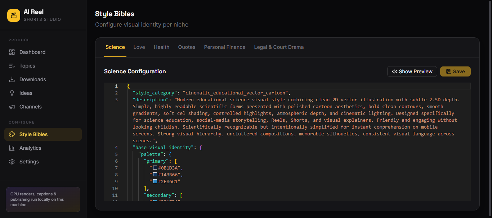
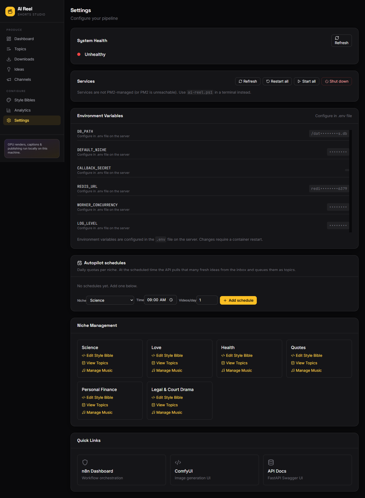

# AI Reel — Shorts Studio

Automated short-form video pipeline. Give it a niche and a topic; it produces
platform-ready vertical shorts (1080×1920) with AI images, voiceover, burned-in
captions, music and transitions, then optionally publishes them.

Runs natively on Windows. No Docker, no WSL, no Redis — SQLite is the queue.



---

## What it does

1. **Script** — an LLM writes a hook, scene breakdown and captions for your topic
2. **Images** — ComfyUI generates one 9:16 still per scene
3. **Voiceover** — Kokoro TTS, then Whisper aligns word timestamps
4. **Render** — FFmpeg applies Ken Burns motion, captions, music and xfades
5. **Publish** — optional, pushes to connected TikTok / YouTube / Meta channels

## Architecture

```
┌────────────────┐   POST /api/topics   ┌────────────────┐
│  React + Vite  │ ───────────────────► │  FastAPI :8000 │
│     :3000      │                      └───────┬────────┘
└────────────────┘                              │ INSERT topic + job
                                                ▼
                                     ┌──────────────────┐
                                     │  SQLite job_queue│
                                     └────────┬─────────┘
                                              │ poll every 2s
                                              ▼
                                    ┌─────────────────────┐
                                    │  Worker  (pythonw)  │
                                    └──────────┬──────────┘
         ┌───────────────┬──────────────┬──────┴───────┬──────────────┐
         ▼               ▼              ▼              ▼              ▼
   ┌───────────┐   ┌──────────┐   ┌────────┐    ┌─────────┐   ┌──────────┐
   │  Script   │   │  Images  │   │  TTS   │    │ Render  │   │ Publish  │
   │ LLM chain │   │ ComfyUI  │   │ Kokoro │    │ FFmpeg  │   │ OAuth    │
   │           │   │  :8188   │   │ Whisper│    │         │   │  APIs    │
   └───────────┘   └──────────┘   └────────┘    └─────────┘   └──────────┘
```

Status moves linearly: `pending → awaiting_approval → scripted →
generating_images → generating_tts → rendering → done` (or `failed`).

## Stack

| Piece | Technology | Notes |
|---|---|---|
| Web UI | React 18 + Vite + Tailwind | 9 pages, responsive |
| API | FastAPI + Uvicorn | ~60 REST endpoints |
| Queue | SQLite `job_queue` table | 2s poll, no broker |
| Script generation | 4-link LLM chain | Kilo gateway → Gemini → Groq → Ollama |
| Image generation | ComfyUI + Qwen-Image GGUF | Must load a real model |
| TTS | Kokoro v0.19 ONNX | Word-aligned via Whisper |
| Video | FFmpeg (NVENC when available) | zoompan, xfade, ASS subs |
| Storage | SQLite | 13 tables |

## The LLM chain

`src/llm/client.py` tries four links in order and falls through on failure:

1. **Kilo gateway** (`kilo:` prefix) — free, tried first when configured
2. **Gemini** — `gemini-3.8-flash`, metered against a daily quota
3. **Groq** — comma-separated model list rolls over on rate limit
4. **Ollama** — `llama3.1:8b` local, the offline floor

A link that fails twice is skipped for 30 minutes, and that health state is
persisted to the `kv_settings` table so a restart does not re-pay for a link
that was already timing out. A per-topic model pin overrides the chain order.

## Platforms and output shapes

| Platform | Size | Ratio |
|---|---|---|
| TikTok | 1080×1920 | 9:16 |
| YouTube Shorts | 1080×1920 | 9:16 |
| Instagram Reels | 1080×1920 | 9:16 |
| Facebook Reels | 1080×1920 | 9:16 |
| Instagram feed | 1080×1350 | 4:5 |
| Instagram square | 1080×1080 | 1:1 |

Images are generated **per shape**, not per topic. A topic requesting both a
reel and a square produces one 9:16 pass and one 1:1 pass; the Ken Burns frame
follows the platform so a square is not a cropped vertical.

## Style bibles

Each niche has a YAML file in `style_bibles/` defining palette, materials,
lighting, composition, camera, typography, per-scene transitions, music style
and SFX. Edit in the UI under Style Bibles or edit the YAML directly.

Bundled: `science`, `love`, `health`, `quotes`, `personal_finance`,
`legal_drama`.

## Running it

Double-click **`Start-AI-Reel.bat`**, or from PowerShell:

```powershell
.\ai-reel.ps1 -Action start
.\ai-reel.ps1 -Action status
.\ai-reel.ps1 -Action logs
.\ai-reel.ps1 -Action stop
```

Batch defaults for a whole session can be set at launch:

```powershell
.\Start-AI-Reel.bat -Model groq:openai/gpt-oss-120b -Quality high_detail -Caption sentence
```

| Service | URL |
|---|---|
| Web UI | http://localhost:3000 |
| API docs | http://localhost:8000/docs |
| ComfyUI | http://localhost:8188 |
| Ollama | http://localhost:11434 (started separately) |

Ollama is deliberately not managed by the starter — start it yourself when you
want local models.

## Configuration

Copy `.env.example` to `.env` and fill it in.

| Variable | Purpose |
|---|---|
| `GEMINI_API_KEY` | Required for the Gemini link |
| `KILO_API_KEY` / `KILO_MODEL` | Free gateway, tried first |
| `GROQ_API_KEY` / `GROQ_MODEL` | Rate-limit rollover list |
| `COMFYUI_URL` | Point at your ComfyUI install |
| `DB_PATH` | SQLite location |
| `OUTPUT_DIR` | Where rendered videos land |
| `FFMPEG_DIR` | FFmpeg `bin` folder |
| `*_CLIENT_ID` / `*_CLIENT_SECRET` | OAuth apps for publishing |

Token usage is tracked per topic and daily-aggregated in `cost_tracking`, with
a daily request ceiling enforced before Gemini is called.

## Layout

```
ai-reel/
├── src/
│   ├── llm/           4-link chain, prompts, model picker
│   ├── image_gen/     ComfyUI client + quality profiles
│   ├── tts/           Kokoro synthesis, Whisper alignment
│   ├── video/         FFmpeg filtergraph builder
│   ├── publish/       OAuth + per-platform upload
│   ├── queue/         Worker, job chain, retry/resilience
│   ├── db/            SQLite repository + schema
│   └── style_bible/   YAML loader
├── web_ui/
│   ├── backend/app/   FastAPI (main.py, routers, models)
│   └── frontend/src/  React pages + components
├── style_bibles/      Per-niche YAML
├── tests/             Standalone test scripts
├── data/topics.db     SQLite database
├── output/            Rendered videos, per topic ID
├── models/ fonts/ music/
└── ai-reel.ps1        start/stop/status/logs
```

## Tests

Each script runs standalone through the venv:

```powershell
venv\Scripts\python.exe -u tests\test_render_speed.py
venv\Scripts\python.exe -u tests\test_output_shapes.py
```

Running the whole `tests\*.py` set spawns a console window per file and runs
ffmpeg renders, so it is slow and noisy — run scripts individually unless you
want the full sweep.

## Troubleshooting

**ComfyUI is up but every image fails** — the server loaded no models. The
launcher checks `object_info` for the Qwen weights, but if you started ComfyUI
by hand, confirm the checkpoint is in its `models/checkpoints/`.

**Script generation times out** — the chain reaches the local model. Set a
`GROQ_API_KEY` or `KILO_API_KEY` so it has a fast paid/free link ahead of Ollama.

**Topic stuck in `waiting`** — the stage's service is down. The worker parks the
job and retries every 20s rather than failing it; bring the service up and it
resumes on its own.

**Out of GPU memory** — ComfyUI runs with `--lowvram --vram-headroom 2`.

## Need a ready-made automation?

> # 🚀 Want this automation ready-made for your workflow?
>
> I can configure and deliver a ready-to-use private automation setup. Send
> your requirements and preferred platforms, and I’ll get back to you directly.
>
> **Email:** [hasibsarkar98@gmail.com](mailto:hasibsarkar98@gmail.com)  
> **Telegram:** [@zero0000101](https://t.me/zero0000101)
>
> **Scan to message me on Telegram:**
>
> [](https://t.me/zero0000101)

## Screenshots

The studio is designed to make the full short-form workflow visible in one
place, from discovering ideas to publishing finished videos.

### Pipeline dashboard

Monitor dependencies, LLM quotas, runtime processes, queue health, pipeline
stages, and recent activity from one live control center.


### Create and manage content

Browse queued and completed topics, filter by niche or upload state, and start
new jobs without leaving the studio.



Generate niche-specific ideas with one click, then queue the angles that are
ready to become videos.



### Configure the visual system

Edit each niche's style bible directly in the UI, including palette,
composition, lighting, and other visual rules used during generation.



Configure services, environment-backed settings, schedules, and niche
management from the settings page.



### Review results and performance

Review finished videos, download outputs, and see which channels have already
received each render.



Track topic volume, token usage, platform distribution, and estimated cost
over time.

